## _Accessories_

___

### Rings

___

#### _TARNISHED COPPER BAND_

The wear and tear shown from this band toughens you up a little.

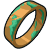

+ Health: `+ 10%`

___

#### _WOODEN STRAND_

Wooden vines woven together to form a ring.


+ Regeneration: `+3/s`

___

#### _THORNPRICK_

Thorny strands of wood woven together to form a ring.

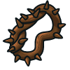

+ Damage Reflection: `+5`

___

#### _STEEL RING_

Adds a weak electrocute ability, which momentarily slows down its target.


##### `hero.canElectrocute(target)` method

Check to see if a `target` is susceptible to being electrocuted.

**Example:**

```javascript
hero.canElectrocute(target);
```

**Required Parameters:**
+ `target`: `object` (ex. `hero`). _The target to check for susceptibility_

##### `hero.electrocute(target)` method

Electrocutes a `target` if within `20m` and slows their movement speed by a factor of electrocuteFactor for `3` seconds.

**Default Stats:**
+ name: `"electrocute"`
+ time: `0.25s`
+ rangeM: `20m`
+ duration: `3s`
+ cooldown: `8s`

**Example:**

```javascript
hero.electrocute(hero.findNearestEnemy());
```

**Required Parameters:**
+ `target`: `object` (ex. `hero.findNearestEnemy()`). _The target on which to electrocute_

___

#### _TOMB RING_

With this cute ring, allied skeletons will obey your commands.

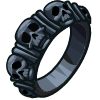

##### `hero.command(target, command, pos)` method

`command` allows you to call any of `commandableMethods` (`["move", "attack", "defend"]`) on allied minions. You can command minions of types in `commandableTypes` (`["skeleton"]`).

(You may not be able to summon all of these types.)

**Example:**

```javascript
var friend = hero.getNearestFriend();
hero.command(friend, 'move', hero.pos);
```

##### `hero.commandableMethods` property

These are all the method names that you can call on allied minion units.

**Current Value:**

```javascript
["move", "attack", "deffend"]
```

##### `hero.commandableTypes` property

These are all the allied minion types that you can command.

(You may not be able to summon all of these types.)

**Current Value:**

```javascript
["skeleton"]
```

___

#### _THE PRECIOUS_

> Essential in some brawls or multiplayer battles

This rune-engraved golden ring whispers maddening secrets into the darkest corners of your mind, oh yes.


+ `hero.canCast()`
+ `hero.cast()`
+ `hero.spells`

##### `hero.cast("invisibility", target)` method

Casts a `"invisibility"` spell on `target` if within `10m`, causes `target` to not be seen by any enemy for `4s` seconds, or until the target attacks.

To see if the target is still invisible, use the `hasEffect` method to see if it has a `"hide"` effect.

**Default Stats:**
+ name: `"invisibility"`
+ time: `0.5s`
+ rangeM: `10m`
+ duration: `4s`
+ cooldown: `12s`

**Example:**

```javascript
hero.cast("invisibility", hero);
```

**Required Parameters:**
+ `target`: `object` (ex. `hero`). _The target on which to cast "invisibility"_

___

#### _RING OF SPEED_

> Extreemly essential thing for speed records

This ring turns even the slowest of heroes into a speed demon.


+ Speed: `+5m/s`

___

### Neckplace

___

#### _ROUGH SENSE STONE_

Lets you check your position in your code

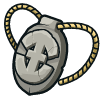

##### `hero.pos` property

The `x` (horizontal) and `y` (vertical) coordinates of the hero's center.

**Example:**

```javascript
// Move 10 meters to the right.
var newX = hero.pos.x + 10;
var newY = hero.pos.y;
hero.moveXY(newX, newY);
```

___

#### _POLISHED SENSE STONE_

Adds introspection of your hero's health and maxHealth.


+ `hero.pos`

##### `hero.health` property

How many health points the `hero` has left.

**Example:**

```javascript
if (hero.health < 200) {
    // Health is low–retreat!
    hero.moveXY(61, 46);
}
else {
    // Health is fine. Fight!
    hero.attack(enemy);
}
```

##### `hero.maxHealth` property

How many health points the `hero` starts with.

**Example:**

```javascript
if (hero.health < hero.maxHealth / 3) {
    // Health is low–retreat!
    hero.moveXY(61, 46);
}
else {
    // Health is fine. Fight!
    hero.attack(enemy);
}
```

___

#### _QUARTZ SENSE STONE_

Adds introspection of your hero's current gold.

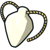

+ `hero.health`
+ `hero.maxHealth`
+ `hero.pos`

##### `hero.gold` property

How much gold the `hero`'s team has.

**Example:**

```javascript
if (hero.gold > 100) {
    hero.say("I'm rich!");
}
```

___

#### _POLISHED AGATE SENSE STONE_

Adds the hasEffect method, which allows you to programmatically know when your hero is affected by a spell or ability.


+ `hero.gold`
+ `hero.health`
+ `hero.maxHealth`
+ `hero.pos`

##### `hero.hasEffect(effect)` method

Returns whether the `spriteName` is currently affected by the given effect.

**Example:**

```javascript
hero.hasEffect("shrink");
```

**Required Parameters:**
+ `effect`: `string` (ex. `"shrink"`)

**Returns:**
+ `boolean`

___

#### _FIRE OPAL SENSE STONE_

Adds introspection of your hero's current target.

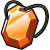

+ `hero.gold`
+ `hero.hasEffect(effect)`
+ `hero.health`
+ `hero.maxHealth`
+ `hero.pos`

##### `hero.target` property

The current `target` upon which the `hero` is running its `action` (`"idle"`). If `target` is set, then `targetPos` is `null`.

___

#### _SAPPHIRE SENSE STONE_

Adds introspection of your hero's target position and velocity.

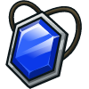

+ `hero.gold`
+ `hero.hasEffect(effect)`
+ `hero.health`
+ `hero.maxHealth`
+ `hero.pos`
+ `hero.target`

##### `hero.targetPos` property

The current `target` position toward which the `hero` is running its `action` (`"idle"`). If `targetPos` is set, then `target` is `null`.

##### `hero.velocity` property

The `hero`'s `velocity` is an (`x`, `y`, `z`) Vector in meters per second. See Vector documentation for more Vector methods (if available in this level).

___

### Glasses

___

#### _CRUDE GLASSES_

Grants findNearestEnemy, so you can target ogres who don't display their names.


##### `hero.findNearestEnemy()` method

Returns the closest living enemy within eyesight (`visualRangem` and `line-of-sight`), or `null` if there aren't any.

**Example:**

```javascript
var enemy = hero.findNearestEnemy();
hero.attack(enemy);
hero.attack(enemy);
```

___

#### _WOODEN GLASSES_

Grants distanceTo and findNearestItem methods, letting you find distances and locate items to collect.

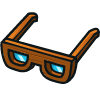

+ Range: `+5m`

+ `hero.findNearestEnemy()`

##### `hero.distanceTo(target)` method

distanceTo:Returns the distance in meters to the target unit from the center of the hero.

##### `hero.findNearestItem()` method

findNearestItem:Returns the closest item within eyesight (visualRangem and line-of-sight), or null if there aren't any.

___

#### _FINE WOODEN GLASSES_

Lets you find arrays of items and find the nearest item separately.

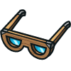

+ Range: `+10m`

+ `hero.distanceTo(target)`
+ `hero.findNearestEnemy()`
+ `hero.findNearestItem()`

##### `hero.findItems()` method

findItems:Returns an array of all items (example types 'coin', 'gem', 'health-potion') within eyesight (visualRangem and line-of-sight).

##### `hero.findNearest()` method

findNearest:Returns the closest unit out of an array of units, or null if the array is empty.

___

#### _MAHOGANY GLASSES_

Replaces findNearestEnemy and findNearestItem with findNearest, adding findEnemies and findFriends. Both new methods allow your hero to be smarter about executing strategies using arrays.

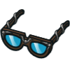

+ Range: `+15m`

+ `hero.distanceTo(target)`
+ `hero.findItems()`
+ `hero.findNearest()`
+ `hero.findNearestEnemy()`
+ `hero.findNearestItem()`

##### `hero.findEnemies()` method

findEnemies:Returns an array of all living enemies within eyesight (visualRangem and line-of-sight).

##### `hero.findFriends()` method

findFriends:Returns an array of all living friends within eyesight (visualRangem).

##### `hero.findNearestFriend()` method

findNearestFriend:Returns the closest living friend within eyesight (visualRangem), or null if there aren't any.

___

#### _KITHGARD WORKER'S GLASSES_

Adds the findByType method to find units or items of a particular type. Useful for constructing logic to react to changing battle conditions.


+ Range: `+20m`

+ `hero.distanceTo(target)`
+ `hero.findEnemies()`
+ `hero.findFriends()`
+ `hero.findItems()`
+ `hero.findNearest()`
+ `hero.findNearestEnemy()`
+ `hero.findNearestItem()`

##### `hero.findByType(type [, units])` method

findByType:Return an array of all the units with the given type that the hero can see, even non-combatants. Optional: pass a second argument as an array of units to filter by type.

___

#### _HARDENED STEEL GLASSES_

Lets you access the `isPathClear` method in your code.


+ Range: `+25m`

+ `hero.distanceTo(target)`
+ `hero.findByType(type [, units])`
+ `hero.findEnemies()`
+ `hero.findFriends()`
+ `hero.findItems()`
+ `hero.findNearest()`
+ `hero.findNearestEnemy()`
+ `hero.findNearestItem()`

##### `hero.isPathClear(start, end)` method

isPathClear:Returns whether there are any obstacles (walls, cliffs, etc.) or hazards (traps, pits, etc.) in the straight line between start and end positions.

___

#### _CRUDE TELEPHOTO GLASSES_

See further than ever before with this harebrained contraption! Also adds the findHazards method, for detecting obstacles and traps.


+ Range: `+40m`

+ `hero.distanceTo(target)`
+ `hero.findByType(type [, units])`
+ `hero.findEnemies()`
+ `hero.findFriends()`
+ `hero.findItems()`
+ `hero.findNearest()`
+ `hero.findNearestEnemy()`
+ `hero.findNearestItem()`
+ `hero.isPathClear(start, end)`

##### `hero.findHazards()` method

findHazards:Returns the hazards (traps, pits, etc.) in the level.

___

#### _FINE TELEPHOTO GLASSES_

Adds findEnemyMissiles, findFriendlyMissiles, and more visualRange. Great for becoming more like Neo from the Matrix.


+ Range: `+60m`

+ `hero.distanceTo(target)`
+ `hero.findByType(type [, units])`
+ `hero.findEnemies()`
+ `hero.findFriends()`
+ `hero.findHazards()`
+ `hero.findItems()`
+ `hero.findNearest()`
+ `hero.findNearestEnemy()`
+ `hero.findNearestItem()`
+ `hero.isPathClear(start, end)`

##### `hero.findEnemyMissiles()` method

findEnemyMissiles:Returns an array of all enemy missiles (example types: 'arrow', 'shell', 'beam', 'spear', 'energy-ball'). Limited to missiles within eyesight (visualRangem and line-of-sight).

##### `hero.findFriendlyMissiles()` method

findFriendlyMissiles:Returns an array of all friendly missiles (example types: 'arrow', 'shell', 'beam', 'spear', 'energy-ball'). Limited to missiles within eyesight (visualRangem and line-of-sight).

___

#### _ENCHANTED LENSES_

See infinite distance with these magical eyes!

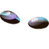

+ Range: `+Infinity`

+ `hero.distanceTo(target)`
+ `hero.findByType(type [, units])`
+ `hero.findEnemies()`
+ `hero.findEnemyMissiles()`
+ `hero.findFriendlyMissiles()`
+ `hero.findFriends()`
+ `hero.findHazards()`
+ `hero.findItems()`
+ `hero.findNearest()`
+ `hero.findNearestEnemy()`
+ `hero.findNearestItem()`
+ `hero.isPathClear(start, end)`

___

#### _TWILIGHT GLASSES_

The ultimate in adventuring eyewear, these glasses let you see through walls.

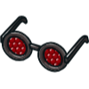

+ Range: `+Infinity`
+ Through walls vision: `true`

+ `hero.distanceTo(target)`
+ `hero.findByType(type [, units])`
+ `hero.findEnemies()`
+ `hero.findEnemyMissiles()`
+ `hero.findFriendlyMissiles()`
+ `hero.findFriends()`
+ `hero.findHazards()`
+ `hero.findItems()`
+ `hero.findNearest()`
+ `hero.findNearestEnemy()`
+ `hero.findNearestItem()`
+ `hero.isPathClear(start, end)`

___

### Watches

___

#### _SUNDIAL WRISTWATCH_

Grants your hero isReady, which tells when various abilities are ready to be used.

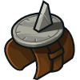

##### `hero.isReady(action)` method

isReady:Returns whether the given action is ready to be used again.

___

#### _SIMPLE WRISTWATCH_

Grants the time property, which enables your hero to get the current time. Useful for timing actions.

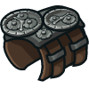

+ `hero.isReady(action)`

##### `hero.time` property

time:The age of the world in seconds, starting from 0.

___

#### _ENGRAVED WRISTWATCH_

Adds the wait method, which enables your hero to pause in place.

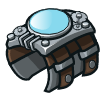

+ `hero.isReady(action)`
+ `hero.time`

##### `hero.wait(time)` method

wait:The wait() method makes the hero wait for a moment before continuing to execute the rest of the code.

___

#### _GILT WRISTWATCH_

Grants the getCooldown method, which allows your hero to know how long various items and abilities take to cooldown. Useful for timing strategies.

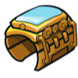

+ `hero.isReady(action)`
+ `hero.time`
+ `hero.wait(time)`

##### `hero.getCooldown(action)` method

getCooldown:...

___

### Belts

___

#### _LEATHER BELT_

This thick belt adds a little extra health.

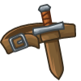

+ Health: `+5`

___

#### _TRAP BELT_

Adds "bear-trap" to buildables. An excellent way to catch big ogres.

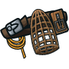

+ `hero.buildTypes`
+ `hero.buildXY(type, x, y)`

___

#### _CALTROP BELT_

Adds "caltrop" to buildables. Caltrops are effective traps for stopping swarms of ogres.

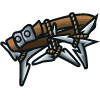

+ `hero.buildTypes`
+ `hero.buildXY(type, x, y)`

___
