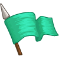
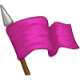

## _Books & Flags_

___


**Table of Contents:**

+ [Books](#books)
    * [Pogrammaticon I](#programmaticon-i)
    * [Pogrammaticon II](#programmaticon-ii)
    * [Pogrammaticon III](#programmaticon-iii)

+ [Flags](#flags)
    * [Basic Flags](#basic-flags)
    * [Dynamic Flags](#dynamic-flags)
    * [Advanced Flags](#advanced-flags)

___


## _Books_


___

### _Pogrammaticon I_

Grants access to loops.


#### `while-true loop` snippet

Using a `while-true loop` lets you run code over and over again. Put the code to repeat inside the `{` and `}` curly braces with four spaces before each line.

**Example:**

```javascript
// Example: looping through a maze.
while (true) {
    hero.moveRight();
    hero.moveDown();
    hero.moveRight();
    hero.moveUp();
}

// Example: attack an enemy over and over.
while (true) {
    var enemy = hero.findNearestEnemy();
    if (enemy) {
        hero.attack(enemy);
    }
}
```

___

### _Pogrammaticon II_

Grants access to if and else.


> _Abilities granted early are supported_
+ `while-true loop`

#### `if/else` snippet

The `if` statement says, "if this is true, then do that".

You can also add `else` to say, "otherwise, do something else instead".

You can even combine `else` with `if` to say, "if this is true, then do that; otherwise, if _this_ is true, then do _that_; otherwise, do something else instead."

**Example:**

```javascript
// Example: if you see an enemy, then attack it.
var enemy = hero.findNearestEnemy();
if (enemy) {
    hero.attack(enemy);
}

// More examples
var enemy = hero.findNearestEnemy();
if (!enemy) {
    // If there is *not* an enemy, then move...
    hero.moveXY(30, 30);
}
else if (enemy.type == "thrower") {
    // ... else if the enemy's type *equals* "thrower", then attack...
    hero.attack(enemy);
}
else if (hero.isReady("cleave") && hero.distanceTo(enemy) < 10) {
    // ... else if "cleave" is ready *and* the distance is *less than* 10m, then cleave...
    hero.cleave(enemy);
}
else {
    // ... else, shield.
    hero.shield();
}
```

#### `else` snippet

The `else` clause can follow an `if` to do something _else_ when the _if_ condition is not true.

**Example:**

```javascript
if (hero.isReady("cleave")) {
    hero.cleave(enemy);
}
else {
    hero.attack(enemy);
}
```

___

### _Pogrammaticon III_

Grants access to break, while loops, and arrays.


> _Abilities granted early are supported_
+ `while-true loop`
+ `if/else`
+ `else`

#### `while-loop` snippet

The `while` loop lets you run code many times--as long as the condition is true.

**Example:**

```javascript
var i = 10;
while(i >= 0) {
    hero.say("Counted to " + i);
    i -= 1;
}
```

#### `break` snippet

The `break` statement terminates a loop.

**Example:**

```javascript
while (true) {
    var enemy = hero.findNearest(hero.findEnemies());
    if (!enemy) {
        break;
    }
    hero.attack(enemy);
}
hero.say("／人 ◕ ‿‿ ◕ 人＼");
```

#### `arrays` snippet

Arrays map indices (integers) to array elements (any type of value).

**Example:**

```javascript
var arr = ["hero is the first element", "hero is the second element"];
hero.say(arr[0]);              // says "hero is the first element"
hero.say(arr[1]);              // says "hero is the second element"
hero.say(arr[arr.length - 1]); // says "hero is the second element

arr[0] = 'new first element';
arr.push('a third element');   // push() adds an element at the end
```

___


### Flags

___

#### _BASIC FLAGS_

Allows you to send real-time input to your hero by placing flags.


##### _`hero.findFlag(color)`_ method

Returns your flag of the given `color`, if it exists. If color is unspecified, returns one of your flags regardless of color. The three flag colors are `"green"`, `"black"`, and `"violet"`.

**Example:**

```javascript
var flag = hero.findFlag();
if (flag) {
    if (flag.color == "black") {
        hero.buildXY("fire-trap", flag.pos.x, flag.pos.y);
    }
    hero.pickUpFlag(flag);
}
```

**Required Parameters:**
+ `color`: `string` (ex. `"green"`). _The color of flag to return_

**Returns:**
+ `object`: The flag object, if it exists.

##### _`hero.pickUpFlag(flag)`_ method

Moves to and removes a flag that was placed during real-time playback. Find the flag with `findFlag` first. The three flag colors are `"green"`, `"black"`, and `"violet"`.

**Example:**

```javascript
var greenFlag = hero.findFlag("green");
if (greenFlag) {
    hero.pickUpFlag(greenFlag);
}
```

**Required Parameters:**
+ `flag`: `flag` (ex. `hero.findDlag("green")`). _The flag to pick up_

___

#### _DYNAMIC FLAGS_

Instead of using pickUpFlag to go to a flag and then remove it, you can now remove a flag from anywhere.



##### _`hero.removeFlag(flag)`_ method

Removes a flag that was placed during real-time playback. Fails if the flag isn't on your team.

___

#### _ADVANCED FLAGS_

You can now access all flags in an array with findFlags.



##### _`hero.findFlags()`_ method

Returns all flags that have currently been placed during real-time playback on your team.

**Returns:**
+ `array`: Flags

___
