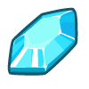

## Code Combat Game Development Theory and Methods
___


### Methods

___

#### _`game.spawnXY(type, x, y)`_

> Spawn something at the given `x`, `y` coordinates.

**Example:**
```javascript
game.spawnXY("fence", 18, 15);
game.spawnXY("munchkin", 20, 25);
game.spawnXY("munchkin", 22, 25);
game.spawnXY("gem", 30, 30);
```

**Required Parameters:**
**`type`** - `string` (ex: `munchkin`) - _the type of object to build_
**`x`** - `number` (ex: `30`) - _the x-coordinate to build at_
**`y`** - `number` (ex: `30`) - _the y-coordinate to build at_

___

#### _`game.spawnPlayerXY(type, x, y)`_

> Spawn a `hero` for the player to control at the given `x`, `y` coordinates.

**Example:**
```javascript
game.spawnPlayerXY("captain", 24, 37);
```

**Required Parameters:**
**`type`** - `string` (ex: `munchkin`) - _The type of hero to spawn._
**`x`** - `number` (ex: `30`) - _the x-coordinate to spawn a hero_
**`y`** - `number` (ex: `30`) - _the y-coordinate to spawn a hero_

___

#### _`game.addMoveGoalXY(x, y)`_

> Add a movement goal at `x`, `y` coordinates. A movement goal is represented in the game by a red X mark. The player will have to move to all the movement goals in order to win.

**Example:**
```javascript
game.addMoveGoalXY(23, 47);
```

**Required Parameters:**
**`x`** - `number` (ex: `30`) - _The x coordinate to add a goal._
**`y`** - `number` (ex: `30`) - _The y-coordinate to add a goal._

___

#### _`game.addCollectGoal(amount)`_

> Adds a goal to the game: The player must collect gems! The argument specifies the number of collectable items the player needs to collect. If there is no argument, the player must collect all the items._

**Example:**
```javascript
game.addCollectGoal();
```

**Optional Parameters:**
**`amount`** - `number` (ex: `5`) - _The amount of items that need to be collected._

___

#### _`game.addDefeatGoal(amount)`_

> Adds a goal to the game: The player must defeat enemies! The argument specifies the number of enemies that need to be defeated. If there is no argument, the player must defeat all the enemies.

**Example:**
```javascript
game.addDefeatGoal();
```

**Optional Parameters:**
**`amount`** - `number` (ex: `5`) - _The amount of items that need to be defeated._

___

#### _`game.addSurviveGoal(seconds)`_

> Adds a goal to the game: If no argument is given, the player must survive until all other goals are completed. If a number argument is given, the player must survive for that many seconds.

**Example:**
```javascript
game.addSurviveGoal();
game.addSurviveGoal(20);
```

**Optional Parameters:**
**`seconds`** - `number` (ex: `20`) - _The number of seconds the player must survive for._

___

#### _`game.spawnMaze(tileType, seed)`_

> Spawns a randomly generated maze of `tileType` tiles. The first argument is a string, type of the object which is used to build a maze. The second argument is a number, changing the number will change the maze.

**Example:**
```javascript
game.spawnMaze("forest", 5);
game.spawnMaze("clump", 23);
```

**Required Parameters:**
**`tileType`** - `string` (ex: `"forest"`) - _The type of the maze tile._
**`seed`** - `number` (ex: `23`) - _The seed number used to generate a maze._

___

#### _`ui.track(obj, prop)`_

> Use `ui.track(obj, "prop")` to display a value of a `obj.prop` to the player

**Example:**
```javascript
ui.track(game, "time");
ui.track(player, "health");
```

**Required Parameters:**
**`obj`** - `object` (ex: `game`) - _The object containing a property you want to show._
**`prop`** - `string` (ex: `"time"`) - _The name (as a string!) of the property you want to show._

___

#### _`game.db.add(key, value)`_

> Use `db.add(key, value)` to increment (add to) a value stored in the database under a key. If a key doesn't exist in the database yet, its value starts at `0`

**Example:**
```javascript
db.add("plays", 1);
```

**Required Parameters:**
**`key`** - `string` (ex: `"plays"`) - _The database key to store a value under._
**`value`** - `number` (ex: `1`) - _The value to increment by._

___


### Spawnable Objects

___

#### Level Objects


+ `"fence"` - A square obstacle, 4 meters on a side.


+ `"forest"` - A square obstacle made of trees, 8 meters on a side.


+ `"fire-trap"` - A trap that explodes when the player gets too close to it. Default stats:
    + `unit.attackDamage = 150`
    + `unit.attackRange = 3`


+ `"fire-spawer"` - A gargoyle statue that shoots deadly fireballs. It has the following configurable properties:
    + `direction` - (string) can be set to `"horizontal"` or `"vertical"`
    + `disabled = false` - (boolean) can be `true` or `false`. True means it won't fire.
    + `spamInterval = 2` - (number) how many seconds it will fire for
    + `spamCooldown = 2` - (number) how many seconds to wait in between firing intervals
    + `spamEvery = 0.2` - (number) how many seconds in between each fireball during firing intervals


+ `"generator"` - A generator continues to spawn units every so often, until it is destroyed. Default Stats:
    + `generator.spawnDelay = 5` - (number) how many seconds to wait between spawns
    + `generator.spawnType = "skeleton"` - (string) type of spawned unit
    + `generator.spawnAI = "AttacksNearest"` - (string) type of spawned unit's AI
    + `generator.maxHealth = 100` - (number) hom many health does it have


___

#### Collectable


+ `"gem"` - A collectable gemstone. Default stats:
    + `gem.value = 5`



+ `"chest"` - A collectable chest full of gems. Default stats:
    + `chest.value = 100`


+ `"potion-small"` - A small health potion. Heals 150 health when collected.


+ `"potion-medium"` - A medium health potion. Heals 350 health when collected.


+ `"potion-large"` - A large health potion. Heals 1000 health when collected.


+ `"lightstone"` - A glowing magical stone. Skeletons will flee from anyone carrying a lightstone.


___

#### Units


+ `"munchkin"` - The weakest ogre unit. Has a melee attack. Default Stats:
    + `unit.team = "ogres"`
    + `unit.maxHealth = 14`
    + `unit.attackDamage = 2`
    + `unit.maxSpeed = 12`


+ `"thrower"` - An ogre with a ranged attack: thrown speaars. Does good damage, but has low health. Default Stats:
    + `unit.team = "ogres"`
    + `unit.maxHealth = 7`
    + `unit.attackDamage = 11`
    + `unit.attackRange = 25`
    + `unit.maxSpeed = 11`


+ `"skeleton"` - A tough enemy, but terrified of anyone holding a Lightstone. Default Stats:
    + `unit.team = "neutral"`
    + `unit.maxHealth = 300`
    + `unit.attackDamage = 15`
    + `unit.maxSpeed = 7`


+ `"soldier"` - A basic human melee unit. Default Stats:
    + `unit.team = "humans"`
    + `unit.maxHealth = 200`
    + `unit.attackDamage = 6`
    + `unit.maxSpeed = 6`


+ `"archer"` - A basic human ranged unit. Default Stats:
    + `unit.team = "humans"`
    + `unit.maxHealth = 30`
    + `unit.attackDamage = 13`
    + `unit.attackRange = 25`
    + `unit.maxSpeed = 9`


___

#### Heroes:


+ `"knight"` - Sir Tharin Thunderfist. Default Stats:
    + `player.maxHealth = 350`
    + `player.attackDamage = 4.32`
    + `player.maxSpeed = 6`


+ `"captain"` - Captain Anya Weston. Default Stats:
    + `player.maxHealth = 350`
    + `player.attackDamage = 4.32`
    + `player.maxSpeed = 6`


+ `"guardian"` - Illia Shieldsmith. Default Stats:
    + `player.maxHealth = 350`
    + `player.attackDamage = 4.32`
    + `player.maxSpeed = 10`


+ `"samurai"` - Hattori Hanzo. Default Stats:
    + `player.maxHealth = 178.57`
    + `player.attackDamage = 9.72`
    + `player.maxSpeed = 8`


+ `"duelist"` - Alejandro the Duelist. Default Stats:
    + `player.maxHealth = 350`
    + `player.attackDamage = 4.32`
    + `player.maxSpeed = 6`


+ `"goliath"` - Okar Stompfoot. Default Stats:
    + `player.maxHealth = 500`
    + `player.attackDamage = 7.68`
    + `player.maxSpeed = 4`


+ `"champion"` - Lady Ida Justheart. Default Stats:
    + `player.maxHealth = 350`
    + `player.attackDamage = 4.32`
    + `player.maxSpeed = 6`


___


### Events

___

#### _Victory_

The `"victory"` event is triggered when a player successfully completes all of a game's goals.

Example:

```javascript
function onVictory(event) {
    db.add("plays", 1);
}

game.on("victory", onVictory);
```

___
