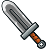

## _Weapon - Ranger_

___

### _CRUDE CROSSBOW_

Modest range and damage; it's the beginner crossbow. But hey, it's cheap!



+ Damage: `8.5`
+ Damage per second: `17.0`
+ Range: `30m`

#### _`hero.attack(target)`_ method

The `attack` method makes the hero attack the `target` unit.

**Example:**

```javascript
// Attack an enemy named "Treg" twice.
hero.attack("Treg");
hero.attack("Treg");

// Attack the nearest enemy once, using a variable.
var enemy = hero.findNearestEnemy();
hero.attack(enemy);
```

**Required Parameters:**

+ `target`: `object` (ex. `hero.findNearestEnemy()`) - _The target enemy to attack_

#### _`hero.attackRange`_ property

How far the hero's attack reaches, in meters.

___
