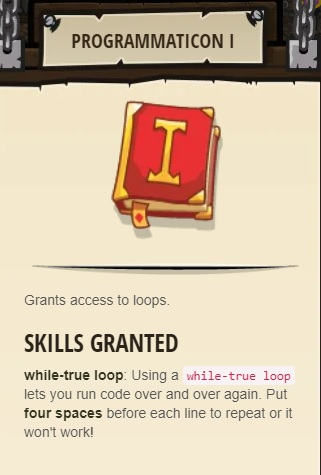

### _Cell Commentary_

##### _Legend says:_
> Trapped in a prison cell with the famous wizard! Say the password to get wizards's help.

##### _Goals:_
+ _Say the password_
+ _Get the pile of Gems_

##### _Topics:_
+ **Basic Sintax**
+ **Arguments**
+ **Strings**
+ **Reading the Docs**

##### _Items we've got (- or need):_
+ Simple boots
+ _Optional: Elemental codex 1+_

##### _Solutions:_
+ **[JavaScript](cellCommentary.js)**
+ **[Python](cell_commentary.py)**

##### _Rewards:_
+ 13 xp
+ 21 gems
+ Programmaticon I



##### _Victory words:_
+ _COOL CAUSTIC CAULDRONS_

___

##### _Hints_

Comments are a way for a programmer to explain their code to another programmer.

In CodeCombat, comments are helpful hints on what to write and how to structure your code!

```javascript
// comment in javaScript - read them for instructions.
```
```python
# comment in python
```

___

##### _Comments_

Comments are a way for two programmers to communicate with each other. They are even useful for a single programmer to remember what they were doing to resume later!

In CodeCombat, we add comments to help you structure your code and give vital hints. Read them to understand what the objective is and what code you need to write to accomplish it.

In this level you will need to read the comments we provide to find the answer, to escape the prison cell!

Comments are pieces of information put in the code editor to help guide your coding.

It is extremely valuable to read each of the lines of code before jumping in!

We provide you with the instructions inside of levels themselves, just read it line by line!

For example, a level might start like this:

```javascript
// Move Up
// Attack Bob
// Say "I win!"
```

Then it is your job to fill in the blanks:

```javascript
// Move Up
hero.moveUp();
// Attack Bob
hero.attack("Bob");
// Say "I win!"
hero.say("I win!");
```

___

##### _Say/Speaking_

The `hero` always has access to the `say` method. This creates a speech bubble above the `hero`'s head saying whatever is inside.

In certain levels this is a requirement! But it can be a useful debugging tool.

```python
hero.say("Let me out!")
hero.say("Kazaam!")
hero.say("I'm here now.")
```
