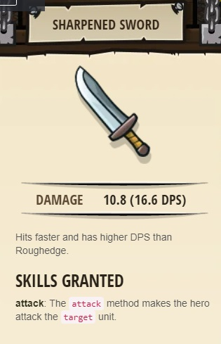

### _The Raised Sword_
##### There's a librerian on bottom side of dungeon running with a "haste"

##### _Legend says:_
> Learn to equip yourself for combat.

##### _Goals:_
+ _Defeat the ogres (3)_
+ _Your hero must survive_
+ _Bonus: no code problems_

##### _Topics:_
+ **Basic Sintax**
+ **Arguments**
+ **Strings**

##### _Items we've got (- or need):_
+ Simple boots
+ Armor
+ _Optional: Emperor's gloves_

##### _Solutions:_
+ **[JavaScript](theRaisedSword.js)**
+ **[Python](the_raised_sword.py)**

##### _Rewards:_
+ 15-22 xp
+ 23-34 gems
+ Sharpened Sword

___

##### _Hints_

Attack each ogre by name. Remember, each ogre takes two hits!

Remember, each munchkin takes two hits to defeat.
Try to defeat them in the order they come at you so that they don't land extra hits on you. 

Make sure to have enough armor to win the fight!
