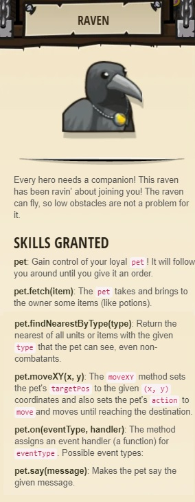
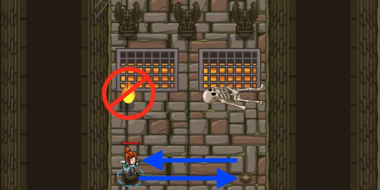

### _Fire Dancing_

##### _Legend says:_
> Save typing (and your hero) with loops!

##### _Goals:_
+ _Dodge the fireballs forever_
+ _Bonus: Under 4 statements_
+ _Bonus: Clean code (no warnings)_

##### _Topics:_
+ **Basic Sintax**
+ **While Loops**

##### _Items we've got (- or need):_
+ Simple boots

##### _Solutions:_
+ **[JavaScript](fireDancing.js)**
+ **[Python](fire_dancing.py)**

##### _Rewards:_
+ 11-23 xp
+ 10-20 gems
+ Raven companion



___

##### _Hints_



Avoid the fireballs by dancing **right** and **left**.

Use a **while-true loop** to repeat forever like this:

```javascript
while (true) {
	hero.moveLeft();  // This will happen over and over.
}
```

Code normally executes in the order it's written. **Loops** allow you to repeat a block of code multiple times without having to re-type it.

___

##### _How To Use while-true Loops_

First, we start a loop with the `while` keyword. This tells your program **WHILE** something is true, repeat the **body** of the loop.

For now we want our loops to continue forever, so we'll use a **while-true loop**. Because true is always true! 

Don't worry about this true stuff too much for now. We'll explain it more later. Just remember that a **while-true loop** is a loop that never ends.

This is how you code a **while-true loop**:

```javascript
// Start the while-true loop with "while (true) {"
// Anything between the { and } is considered INSIDE the loop

while (true) {
	hero.moveRight();
	hero.moveLeft();
}

hero.say("This line is not inside the loop!");

// Tip: the indention (spacec at the start of the lines) is optional
// in javaScript (but not in Python), but it makes your code easier to read!
```

_Tip: You can put whatever you want inside a while-true loop! But for this level, we only need to repeat two commands: `moveRight()` and `moveLeft()`._

___

##### _Code Limits_

Some levels have a strict amount of lines of code you're required to write!

If you find yourself going over the limit, consider using a `while-true` loop to shorten your code.

For example:

```javascript
hero.moveRight();
hero.moveUp();
hero.moveRight();
hero.moveUp();
hero.moveRight();
hero.moveUp();
```

Becomes:

```javascript
while (true) {
	hero.moveRight();
	hero.moveUp();
}
```
