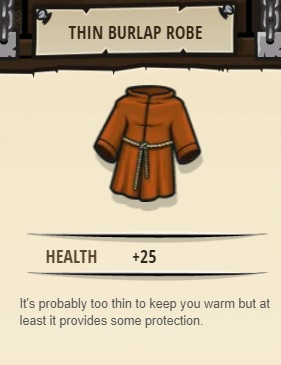
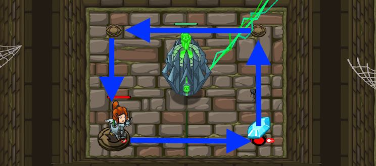

### _Loop Da Loop_

##### _Legend says:_
> Loops are a life saver!

##### _Goals:_
+ _Avoid the deadly lightning beam_
+ _Under 6 statements_

##### _Topics:_
+ **Basic Sintax**
+ **While Loops**

##### _Items we've got (- or need):_
+ Simple boots

##### _Solutions:_
+ **[JavaScript](loopDaLoop.js)**
+ **[Python](loop_da_loop.py)**

##### _Rewards:_
+ 23 xp
+ 18 gems
+ Thin Burlap Robe



___

##### _Hints_



You only need _one_ **while-true loop** containing **4 commands** to survive this level!

Double check your indentation!

Make sure the commands you add are **inside** the **while-true loop**.

___

##### _Looping (While-True)_

Sometimes a certain piece of code needs to be repeated **forever**! Dodging **fireballs** or escaping a long **maze** are two of many use cases! A `while-true` loop can do this!

A `while-true` loop could be considered a **container** of your code that repeats it over and over.

With this concept, it is important to match the **syntax** closely, as this is what the computer reads to perform it.

For example:

```javascript
while (true) {  // Notice while, true and {
	hero.moveRight();  // Notice the indentation
	hero.moveUp();  // Notice the indentation
}  // Notice the }
```

Code outside of the `while-true` loop will **NEVER** run!

Once you enter a `while-true` loop, no more code after will be ran!
An example:

```javascript
while (true) {
	// Everything between the { and } repeats!
	// Yes
}

// And code down here will NEVER run!
// The code will be stuck in while-true loop.
```
