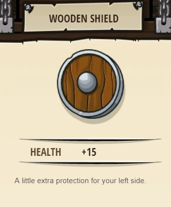
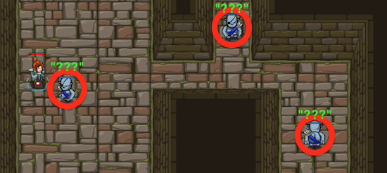

### _Master of Names_

##### _Legend says:_
> Use your new coding powers to target nameless enemies.

##### _Goals:_
+ _Your hero must survive_
+ _Defeat the three ogres_
+ _Bonus: clean code (no warnings)_

##### _Topics:_
+ **Basic Sintax**
+ **Arguments**
+ **Variables**

##### _Items we've got (- or need):_
+ Boots
+ Weapon
+ _Optional: good weapon_

##### _Solutions:_
+ **[JavaScript](masterOfNames.js)**
+ **[Python](master_of_names.py)**

##### _Rewards:_
+ 20-30 xp
+ 29-43 gems
+ Wooden Shield



##### _Victory words:_
+ _SOON YOU WILL BE MASTER OF PROGRAMMING!_

___

##### _Hints_



Variables contain information to be referenced later. You can assign a new value to a variable any time you want.

Use `findNearestEnemy()` to target the nearest enemy.

```javascript
var closestEnemy = hero.findNearestEnemy();
```

Remember from the last level, **variables** are symbols that represent data. The variable's value can **vary** as you store new data in it, which is why it's called a variable.

Now instead of using the names of the enemies, you can use your glasses and the `findNearestEnemy()` method to store references to the ogres in variables. You don't need to use their names.

When you call the `findNearestEnemy()` method, you **must store the result in a variable**, like `enemy3` (you can name it whatever you want). The variable will remember what the nearest enemy **was** when you called the `findNearestEnemy()` method, so make sure to call it when you see a nearby enemy.

Remember: when you use quotes, like `"Kratt"`, you are making a **string**. When you don't use quotes, like `enemy1`, you are referencing the `enemy1` **variable**.

Ogre munchkins still take two hits to defeat.

___

##### _Finding Nearby Enemies_

With glasses, the `hero` has access to the `findNearestEnemy` **method**.

But, the interesting thing about this **method** is that it **returns** something! It returns the nearest enemy to the `hero`.

The **method** on it's own isn't too useful. However when combined with a `variable`, it can be used to find any nearby enemy and attack them!

```javascript
hero.findNearestEnemy();  // This find nearest enemy, but doesn't store it anywhere!
var enemy = hero.findNearestEnemy();  // Now there is a variable to attack!

hero.attack(enemy);
```

___

##### _Finding Nearby Enemies_

The `attack` **method** can be used to target enemy units, as well!

If the hero knows the name of the enemy:

```javascript
hero.attack("name of the enemy");
```

If the `hero` doesn't know the enemy's name, passing in a **reference** to the unit allows the `hero` to `attack` them.

```javascript
var foe = hero.findNearestEnemy();  // Set foe to a nearby enemy.
hero.attack(foe);  // Attack the enemy in the foe variable.
```
