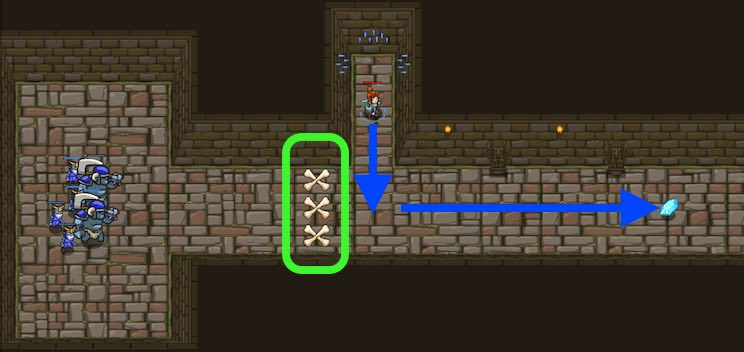

### _Kithgard Gates_

##### _Legend says:_
> Escape the Kithgard dungeons, and don't let the guardians get you.

##### _Goals:_
+ _Your hero must survive_
+ _Get out of the Dungeon_

##### _Topics:_
+ **Basic Sintax**
+ **Arguments**
+ **Strings**

##### _Items we've got (- or need):_
+ Simple boots
+ _Optional: Elementals codex 1+_
+ _Optional: Emperor's gloves_

##### _Solutions:_
+ **[JavaScript](kithgardGates.js)**
+ **[Python](kithgard_gates.py)**

##### _Rewards:_
+ 29-43 xp
+ 38-56 gems

##### _Victory words:_
+ _YOU MADE IT OUT OF KITHGARD WITH YOUR LIFE. NICE._

___

##### _Hints_



`buildXY("fence", x, y)` allows you to build a fence at a certain spot, like this:

```javascript
hero.buildXY("fence", 40, 20);
```

Mouse over the map to find where you want to place the fence, and replace those numbers with the X and Y arguments of `buildXY`.

When you use a builder's hammer, instead of the `attack` method, you get the `buildXY` method. `buildXY` takes three arguments, instead of one: `buildType`, `x` and `y`. So you can decide what to build and where to build it.

+ `buildType`: either the string `"fence"`, to build fences, or the string "fire-trap", to build fire traps.
+ `x`: the horizontal position at which to build. You can **hover over the map** to find coordinates.
+ `y`: the vertical position at which to build. `x` and `y` are both in meters.

This level is **much easier to beat with** `"fence"` than with `"fire-trap"`. It's almost impossible to use fire traps to defeat the ogres. If you want to try it, fine, but it took us fifteen minutes to figure it out, and we built the level.

You only need to build three fences to stop the ogres and escape the dungeon to the right.

___

##### _Multiple Arguments_

Some **methods** can take multiple **arguments**!

To insert multiple **arguments** into a **method**, include `,` between each of the **arguments**.

**Methods** like `buildXY` require a very strict order for their **arguments** so be sure to check for examples and read the guide.

```javascript
// buildXY takes 3 arguments!
// That means you need 2 comas to separate all 3 arguments.
hero.buildXY("fence", 20, 20);
hero.buildXY("fire-trap", 40, 40);
```

___

##### _Building Defenses_

When the `hero` has a **hummer**, they can build defenses like `"fence"`s and `"fire-trap"`s.

However, the `hero` need to know the exact **coordinate** location of where to build! That is why the **method** is called `buildXY`, because it needs an `x` and `y` position.

Mouse-over the level map and after a second the **coordinates** will appear. Use this to guide where to `buildXY`.

The **arguments** in order are:
+ item *type* as a `string` such as `"fence"` and `"fire-trap"`.
+ item position `x`, which is always a number.
+ item position `y`, which is always a number.

For example:

```javascript
hero.buildXY("fence", 20, 20);
```

___

##### _Building Defenses_
