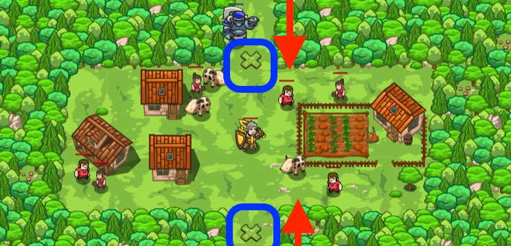

### _Defense of Plainswood_

##### _Legend says:_
> Protect the peasant village of Plainswood from the ogres.

##### _Goals:_
+ _Vilagers must survive_
+ _Bonus: clean code (no warnings)_

##### _Topics:_
+ **Basic Sintax**
+ **Arguments**
+ **Strings**
+ **Coordinate Pairs**

##### _Items we've got (- or need):_
+ Simple boots
+ _Optional: Elementals codex 1+_
+ _Optional: Emperor's gloves_

##### _Solutions:_
+ **[JavaScript](kithgardGates.js)**
+ **[Python](kithgard_gates.py)**

##### _Rewards:_
+ 30-45 xp
+ 37-55 gems
+ Leather Boots


##### _Victory words:_
+ _PLAINSWOOD IS PROTECTED FROM OGRES._

___

##### _Hints_



Move your mouse cursor over a spot to find the `x` and `y` numbers of the location.

Remember how to build:

```python
hero.buildXY("fence", 40, 52)
```

___


Use your `buildXY` skills to build `"fence"`s and block out the ogres!

Remember to hover over the level map to find `x` and `y` coordinates for your `buildXY` method. In this case, you want to build on the X marks at `40, 52` and `40, 20`.

It is much, much easier to do this level by building type `"fence"` than by building type `"fire-trap"`.

___

##### _X, Y Coordinates_

A position on the game map is represented as two numbers: `x` and `y` coordinates.

`x` represents the **right-left** (horizontal) direction.

`y` represents the **up-down** (vertical) direction.

Moving in the **right** direction, the `x` number **increases**. Moving in the **left** direction, the `x` number **decreases**.

Moving in the **up** direction, the `y` number **increases**. Moving in the **down** direction, the `y` number **decreases**.

The bottom left corner of the map is `0, 0` (**x** is zero, **y** is zero).

___

## _Big review of My current Items (july 3, 2019 - 35 level)_

### _Heroes_

> First of all, from start we've got one natural ability.

##### `hero.say(message)` method

Makes the hero say the given message. Anything within `20` meters will hear it.

+ Action name: `"say"`
+ Time: `1s`

**Example:**

```javascript
hero.say("Hi!");
```

**Required Parameters:**
+ `message`: `string` (ex. `"Hi!"`)

___

#### _Standart Heroes_

They have idential statistics, so they difference only cosmetic. They doesn't have any special abilities.

**Statistics:**
+ Difficulty: `Easy`
+ Type: `Warrior`
+ Weapons: `Swords - Short Range, No Magic`
+ Damage: `120%`
+ Health: `140%`
+ Speed: `6 m/s`

##### Captain _Anya Weston_

Anya is a no-nonsense leader who isn't afraid to go in and get the job done, whether it's defending a village, raiding an ogre base, or picking up shiny things.


##### Sir _Tharin Thunderfist_

A mighty warrior. Tharin loves just three things: exploring, building stuff, and combat. He's tough but slow.


##### Lady _Ida Justheart_

Lady Ida Justheart is a champion of the people, questing for justice across all the lands. No one knows what she does in her spare time.


##### _Alejandro the Duelist_

Alejandro travels across the world, seeking out challenges to test his skills with his impractically gigantic sword and tiny shield.


___

#### _Silver Heroes_

##### _Amara Arrowhead_

Stealthy and silent, Amara’s ranged attacks can pick off the fastest of ogres with ease. But keep her away from the fray as her armor is light!

**Statistics:**
+ Difficulty: `Medium`
+ Type: `Ranger`
+ Weapons: `Crossbows, Guns - Long Range, No Magic`
+ Damage: `100%`
+ Health: `120%`
+ Speed: `10 m/s`


##### Miss _Hushbaum_

Hushbaum learned her trade at the citadel and honed it on the battlefield. Her wand and staff allow her to bend the laws of reality.

> My first choise of start hero for dungeon \ forest. But too slow for any speed records.

**Statistics:**
+ Difficulty: `Hard`
+ Type: `Wizard`
+ Weapons: `Wands, Staffs - Long Range, Magic`
+ Damage: `120%`
+ Health: `140%`
+ Speed: `7 m/s`


##### _Hattori Hanzō_

Hattori is an honorable retainer and fearless warrior. His speed and high damage make him ideal for taking on heavily-armored enemies.

**Statistics:**
+ Difficulty: `Easy`
+ Type: `Warrior`
+ Weapons: `Swords - Short Range, No Magic`
+ Damage: `180%`
+ Health: `71%`
+ Speed: `8 m/s`


___

#### _Premium Heroes_

> As for now I only got one speedy hero to perform advanced solutions.

##### _Pender Spellbane_

Nobody knows where Pender came from, but the few who have asked did not live to tell the tale. She sees great power in you.

**Statistics:**
+ Difficulty: `Hard`
+ Type: `Wizard`
+ Weapons: `Wands, Staffs - Long Range, Magic`
+ Damage: `180%`
+ Health: `52%`
+ Speed: `14 m/s`

###### `hero.manaBlast()` method

The `"mana-blast"` action makes the hero do a powerful magical blast centered around the hero, dealing up to `100` damage to targets at the center of the `20m` blast.

+ Action name: `"mana-blast"`
+ Time: `0.75s`
+ Cooldown: `15s`
+ Damage: `100`
+ Radius: `20m`

**Example:**

```javascript
hero.manaBlast();
```

###### `hero.resetCooldown(action)` method

Resets the given `action` cooldown, making it ready to be used again, if the `reset-cooldown` ability is ready. Can also reset spell cooldowns.

+ Action name: `"reset-cooldown"`
+ Time: `0.25s`
+ Cooldown: `20s`

**Example:**

```javascript
hero.resetCooldown("raise-dead");
```

**Required Parameters:**
+ `action`: `string` (ex. `"raise-dead"`). _The action to reset_


___

### _Books_

#### _Pogrammaticon I_

Grants access to loops.

##### `while-true loop` snippet

Using a `while-true loop` lets you run code over and over again. Put the code to repeat inside the `{` and `}` curly braces with four spaces before each line.

**Example:**

```javascript
// Example: looping through a maze.
while (true) {
    hero.moveRight();
    hero.moveDown();
    hero.moveRight();
    hero.moveUp();
}

// Example: attack an enemy over and over.
while (true) {
    var enemy = hero.findNearestEnemy();
    if (enemy) {
        hero.attack(enemy);
    }
}
```


#### _Pogrammaticon II_

Grants access to if and else.

> _Abilities granted early are supported_

##### `if/else` snippet

The `if` statement says, "if this is true, then do that".

You can also add `else` to say, "otherwise, do something else instead".

You can even combine `else` with `if` to say, "if this is true, then do that; otherwise, if _this_ is true, then do _that_; otherwise, do something else instead."

**Example:**

```javascript
// Example: if you see an enemy, then attack it.
var enemy = hero.findNearestEnemy();
if (enemy) {
    hero.attack(enemy);
}

// More examples
var enemy = hero.findNearestEnemy();
if (!enemy) {
    // If there is *not* an enemy, then move...
    hero.moveXY(30, 30);
}
else if (enemy.type == "thrower") {
    // ... else if the enemy's type *equals* "thrower", then attack...
    hero.attack(enemy);
}
else if (hero.isReady("cleave") && hero.distanceTo(enemy) < 10) {
    // ... else if "cleave" is ready *and* the distance is *less than* 10m, then cleave...
    hero.cleave(enemy);
}
else {
    // ... else, shield.
    hero.shield();
}
```

##### `else` snippet

The `else` clause can follow an `if` to do something _else_ when the _if_ condition is not true.

**Example:**

```javascript
if (hero.isReady("cleave")) {
    hero.cleave(enemy);
}
else {
    hero.attack(enemy);
}
```


#### _Pogrammaticon III_

Grants access to break, while loops, and arrays.

> _Abilities granted early are supported_

##### `while-loop` snippet

The `while` loop lets you run code many times--as long as the condition is true.

**Example:**

```javascript
var i = 10;
while(i >= 0) {
    hero.say("Counted to " + i);
    i -= 1;
}
```

##### `break` snippet

The `break` statement terminates a loop.

**Example:**

```javascript
while (true) {
    var enemy = hero.findNearest(hero.findEnemies());
    if (!enemy) {
        break;
    }
    hero.attack(enemy);
}
hero.say("／人 ◕ ‿‿ ◕ 人＼");
```

##### `arrays` snippet

Arrays map indices (integers) to array elements (any type of value).

**Example:**

```javascript
var arr = ["hero is the first element", "hero is the second element"];
hero.say(arr[0]);              // says "hero is the first element"
hero.say(arr[1]);              // says "hero is the second element"
hero.say(arr[arr.length - 1]); // says "hero is the second element

arr[0] = 'new first element';
arr.push('a third element');   // push() adds an element at the end
```


___

### _Armor_

___

### _Secondary_

___

### _Primary_

___

### _Accessories_

___

### _Misc_
