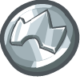

### _Agony of Defeat_

##### _Legend says:_
> Snatching loose change from the jaws of defeat.

##### _Goals:_
+ _Collect 8 coins_
+ _Win the game_

##### _Topics:_
+ **Strings**
+ **Variables**
+ **If Statements**
+ **While Loops**
+ **Accessing Properties**
+ **Event Data**

##### _Solutions:_
+ **[JavaScript](agonyOfDefeat.js)**

##### _Rewards:_
+ 10 xp
+ 10 gems

##### _Victory words:_
+ _IT'S ALL ABOUT THE LOOT DROPS._

___

##### _Coins_

A collectable coins.

###### _Gold coin_


**Default Stats:**
+ `type: "gold-coin"`
+ `voin.value = 3`

**Example:**
```python
# usage code 
game.spawnXY("gold-coin", 21, 20)
```

###### _Silver coin_



**Default Stats:**
+ `type: "silver-coin"`
+ `voin.value = 2`

**Example:**
```python
# usage code 
game.spawnXY("silver-coin", 21, 20)
```

###### _Bronze coin_


**Default Stats:**
+ `type: "bronze-coin"`
+ `voin.value = 1`

**Example:**
```python
# usage code 
game.spawnXY("bronze-coin", 21, 20)
```

___

##### _`"defeat"` event_

The `"defeat"` event is triggered when a unit s defeated.

**Example:**

```javascript
function onDefeat(event) {
    var unit = event.target;
    var x = unit.pos.x + game.randomInteger(-5, 5);
    var y = unit.pos.y + game.randomInteger(-5, 5);
    game.spawnXY("gold-coin", x, y);
}

game.setActionFor("munchkin", "defeat", onDefeat);
```

When a unit i defeated, a `"defeat"` event is triggered:

```python
def onDefeat(event):
    unit = event.target
    unit.say("You got me!")

game.setActionFor("munchkin", "defeat", onDefeat)
```

In this level, you'll spawn a `"gold-coin"` near a defeated unit using thre `"defeat"` event.

Using the `"defeat"` event, we can have enemies drop loot!

When a munchkin is defeated, spawn a `"gold-coin"` near the defeated munchkin's `pos` by adding a `randomInteger` between `-5` and `5` to the `pos.x` and `pos.y`.

When playing your game, you may notice that sometimes the munchkins don't seem to spawn a coin. 
Don't worry - the coin is probably just being spawned on top of the player, who immediately collects it.
