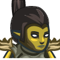
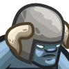
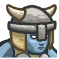

### _Stick Shift_

##### _Legend says:_
> Learn how to create custom goals for your games!

##### _Goals:_
+ _Add a Manual Goal to Defeat the Boss_
+ _Win the game_

##### _Topics:_
+ **Basic Syntax**
+ **Place game objects**
+ **Basic Game AI**
+ **Basic Event Handling**
+ **Create a playable, sharable game project**

##### _Solutions:_
+ **[JavaScript](stickShift.js)**

##### _Rewards:_
+ 10 xp
+ 10 gems

##### _Victory words:_
+ _ASSUMING DIRECT CONTROL..._

___

##### _Hints_

Now you can create custom goals for your games!

We call them **manual** goals, because you are responsible for manually marking them as succeeded or failed.

Create a manual goal like this:

```python
myGoal = game.addManualGoal("Defeat the skeleton, save the archer!")

def onDefeat(event):
    unit = event.target
    if unit.type == "skeleton":
        game.setGoalState(myGoal, True)
    if unit.type == "archer":
        game.setGoalState(myGoal, False)

game.setActionFor("archer", "defeat", onDefeat)
game.setActionFor("skeleton", "defeat", onDefeat)
```

##### _New Emeny Units_

+ `"scout"` -  The mediocre ogre unit. It's stronger than a munchkin. Has a melee attack. Default Stats:
    + `unit.team = "ogres"`
    + `unit.maxHealth = 75`
    + `unit.attackDamage = 12`
    + `unit.maxSpeed = 12`



+ `"ogre"` -  A big ogre. Default Stats:
    + `unit.team = "ogres"`
    + `unit.maxHealth = 120`
    + `unit.attackDamage = 18`
    + `unit.maxSpeed = 5`



+ `"ogre-f"` -  A bigger ogre. Default Stats:
    + `unit.team = "ogres"`
    + `unit.maxHealth = 250`
    + `unit.attackDamage = 30`
    + `unit.maxSpeed = 7`
    + P.S.: `unit.type = "ogre"` (not `"ogre-f"`)


