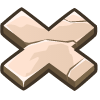

### _Pressure Plate_

##### _Legend says:_
> Use pressure plates to trigger fun game effects!

##### _Goals:_
+ _Activate all the fire spewers_
+ _Spawn at least 30 munchkins_
+ _Win the game_

##### _Topics:_
+ None

##### _Solutions:_
+ **[JavaScript](pressurePlate.js)**

##### _Rewards:_
+ 30 xp
+ 30 gems

##### _Victory words:_
+ _WATCH YOUR STEP!_

___

##### _Hints_

`"collide"` events can tell you when two objects collide, but what about objects that don't collide?

Use your main game loop to check for the hero's proximity to a non-colliding object:

```python
player = game.spawnXY("captain", 10, 20)

# X Marks don't collide (the player can walk through it)
xmark = game.spawnXY("x-mark-stone", 20, 20)

def checkForProximity():
    if xmark.distanceTo(player) <= 1:
        # Do something interesting!

# This is the main game loop.
while True:
    checkForProximity()
```

##### _Land Marks_

###### `x-mark-stone`

An X Mark made of stone.



**Example:**

```javascript
var xmark = game.spawnXY("x-mark-stone", 12, 40);

function checkProximity() {
    if(xmark.distanceTo(player) <= 1) {
        // Do something interesting!
    }
}

while(true) {
    checkProximity();
}
```

###### `x-mark-bones`

An X Mark made of bones.


**Example:**

```javascript
var xmark = game.spawnXY("x-mark-bones", 12, 40);

function checkProximity() {
    if(xmark.distanceTo(player) <= 1) {
        // Do something interesting!
    }
}

while(true) {
    checkProximity();
}
```

###### `x-mark-wood`

An X Mark made of wood.


**Example:**

```javascript
var xmark = game.spawnXY("x-mark-wood", 12, 40);

function checkProximity() {
    if(xmark.distanceTo(player) <= 1) {
        // Do something interesting!
    }
}

while(true) {
    checkProximity();
}
```
